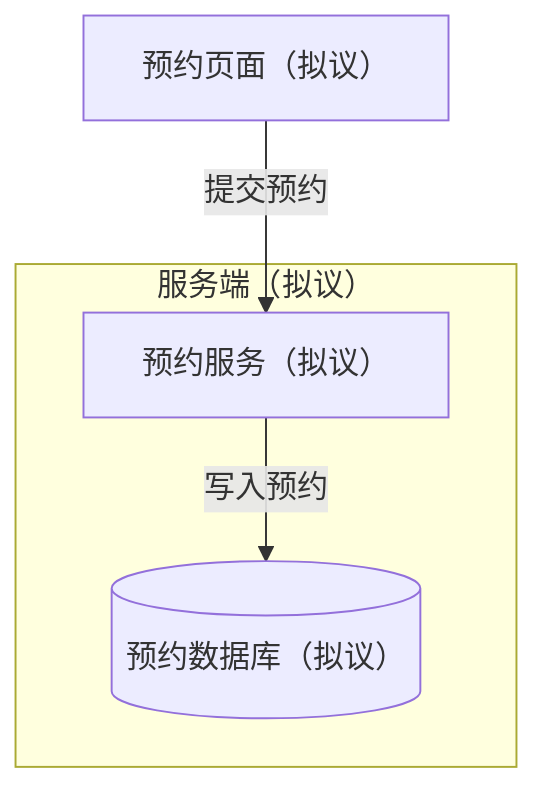

# Architecture using flowchart

For a small component view, stable flowchart notation often suffices. State scope and make every edge's meaning explicit: a request, data write, event, or dependency. Use subgraphs only for evidenced boundaries. Do not assume experimental C4 or newer architecture syntax is available in every host.

Fictional proposed design: an appointment service receives requests from a web page and stores appointments in a database. Flowchart fits this component/boundary question; it makes no timing claim. “提交预约” and “写入预约” are indispensable labels because unlabeled arrows would not distinguish a request from storage access.

Summary: in this proposal, the page submits a request to a service, which writes the appointment to a database.

The rectangle/cylinder distinction carries component/store meaning; color is unnecessary. The boundary does not imply a network trust policy or deployment topology. Do not add queues, caches, replicas, capacity figures, protocols, or ownership claims without evidence. Show unknown links in prose rather than asserting connectivity. Split component overview and one interaction detail if both questions would overload the same view.

Official syntax: https://mermaid.js.org/syntax/flowchart.html

For an explicitly requested newer notation, first check the target host/version against https://mermaid.js.org/syntax/architecture.html or https://mermaid.js.org/syntax/c4.html. No cross-host support is promised.
