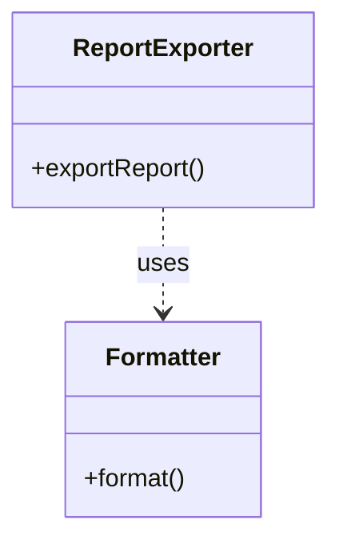

# Class

Use for software types and structural relationships. Choose inheritance, composition, aggregation, association, or dependency only when supported by code or the stated model. Arrow style carries meaning.

Fictional example: a report exporter depends on a formatter. Class notation fits because the question is a type-level dependency. The `uses` label and dependency arrow are indispensable; this view does not claim that the exporter owns the formatter's lifetime.

Summary: exporting a report uses a formatter.

Preserve exact identifiers when explaining real code. Add members, visibility, generics, and multiplicities only when they help answer the main question and are supported. For call order or runtime messages, use a sequence view instead.

Official syntax: https://mermaid.js.org/syntax/classDiagram.html
