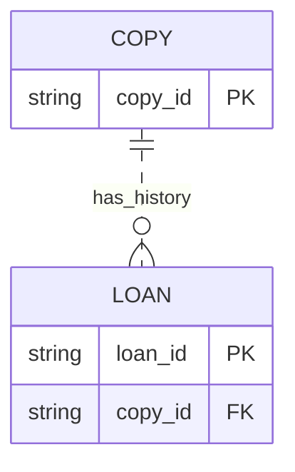

# Entity relationships

Use for entities, attributes, keys, and cardinality (how many records can relate). Every cardinality is a factual claim; ask or mark the relationship unknown in prose when the source does not establish it.

Fictional example: a library copy can have zero or more historical loans, and each loan belongs to exactly one copy. ER fits because the question is record association, not execution order. The relationship label and both cardinality endpoints are indispensable. Attributes below are fictional, not recommendations for an existing schema.

Summary: one copy may have many historical loans; each loan references exactly one copy.

Here `||` means exactly one and `o{` means zero or more. The dashed relationship is non-identifying: a loan has its own primary key. This history relationship does not prove a limit on concurrent active loans. Keep data types, key markers, and identity/dependency semantics consistent with the actual model. Do not derive database constraints solely from application naming.

Official syntax: https://mermaid.js.org/syntax/entityRelationshipDiagram.html
