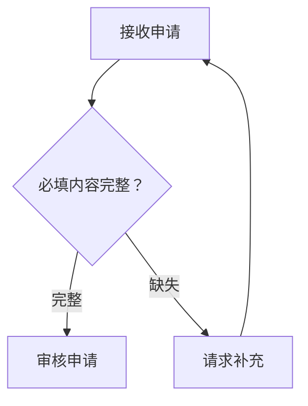
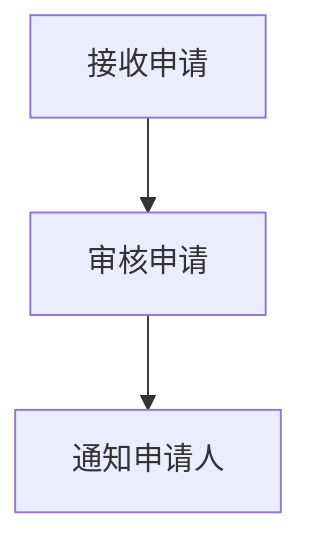
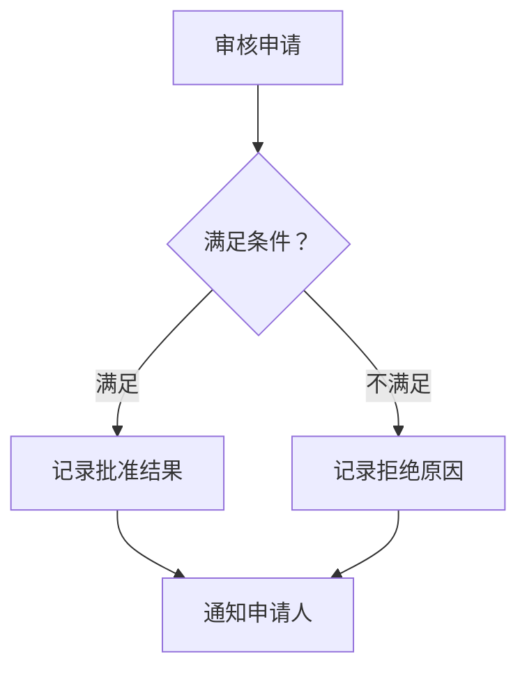

# Flowchart

Use for actions, branches, and paths meeting. Keep actions and decisions distinct, and label each decision exit. A meeting of arrows alone does not imply synchronization.

Fictional example: an application proceeds to review only when its required fields are present. A flowchart fits because the main question is which action follows the check. “完整” and “缺失” are indispensable branch results; removing them would hide the rule.

Summary: complete applications enter review; incomplete ones return for more information.

For a more complex fictional process, split by question:

**Overview — which stage follows review?**

**Detail — what are the review outcomes?**

The overview intentionally abstracts the internal review decision; the detail retains both real outcomes and the same stage names. “满足” and “不满足” explain the branching rule, and the shared notification action explains convergence. No invented routing node is needed.

Use quoted labels and uncomplicated identifiers. Choose direction for the reading context; verify subgraph direction behavior when external links are present.

Official syntax: https://mermaid.js.org/syntax/flowchart.html
