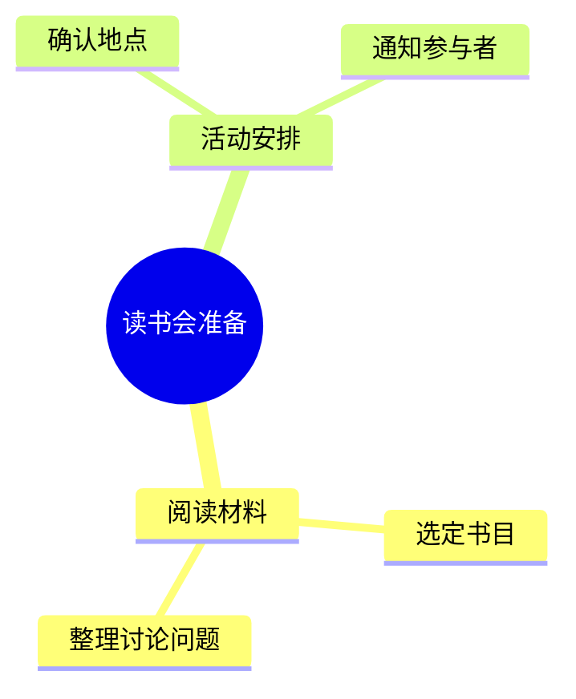

# Mindmap

Use for a conceptual hierarchy where parent-child grouping is the relationship. Indentation carries structure. It does not express event order, dependency, or causation.

Fictional example: group a reading club's preparation work by topic. Mindmap fits because the question is “which topics belong together?” The intermediate labels “阅读材料” and “活动安排” are indispensable grouping names; removing them would flatten two distinct concerns.

Summary: preparation is grouped into reading material and activity arrangements.

Check the host's mindmap support before relying on it. Use consistent indentation and avoid optional icons or markup without support evidence. If unavailable and a hierarchy is still needed, a supported flowchart can express the same parent-child facts; disclose the notation change. Do not silently recast dependencies as hierarchy.

Official syntax: https://mermaid.js.org/syntax/mindmap.html
