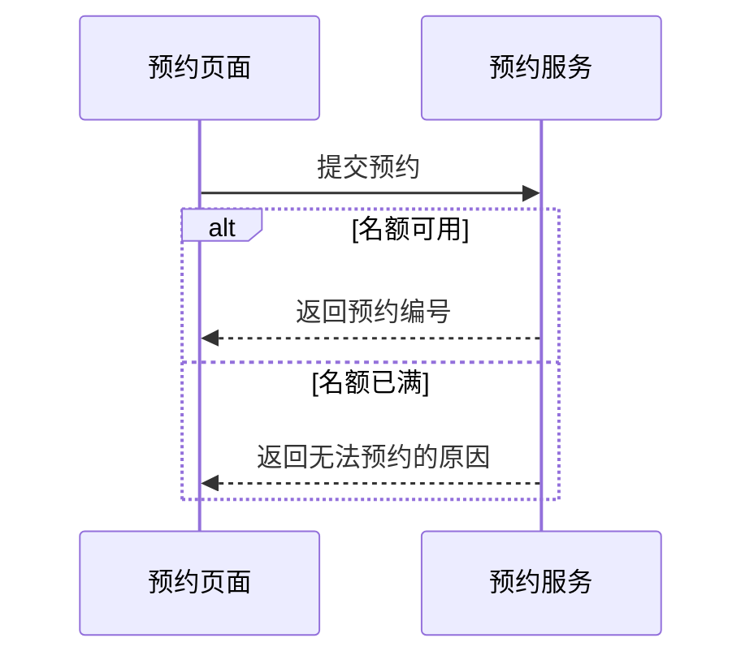

# Sequence

Use when order and responsibility handoffs matter. Declare participants in reading order. Label messages with actions or payload meaning; use `alt` only for evidenced alternatives. Activation bars and asynchronous arrows require a real semantic reason.

Fictional example: a portal asks a booking service for a reservation. Sequence fits the question “who answers whom, after which request?” Participant names, the request, and both alternative conditions are indispensable; exact latency and retry counts are unknown and omitted.

Summary: the booking service returns either a reservation identifier or the reason no reservation is available.

The dashed arrows here mean replies by local convention, not a claim about transport or timing. Do not invent a database round trip or an error handler simply to fill out the diagram. Nested alternatives become difficult to read; split an interaction detail when needed.

Official syntax: https://mermaid.js.org/syntax/sequenceDiagram.html
