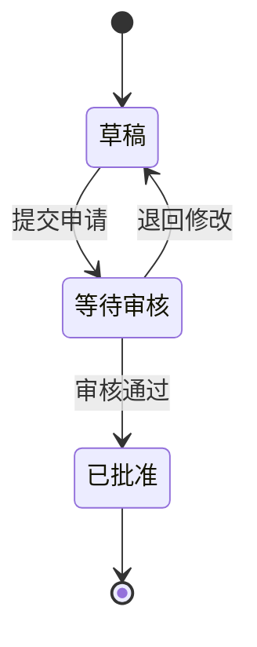

# State

Use for one object's lifecycle. Name states as conditions, and label transitions with events or known guards. Initial and final markers need a meaningful lifecycle boundary.

Fictional example: a draft can be submitted, approved, or returned for revision. State notation fits because the question concerns the application's condition over time. The “退回修改” transition is indispensable: without it, the lifecycle would falsely look irreversible.

Summary: submitting a draft starts review; review either returns it for changes or ends this modeled lifecycle with approval.

Finality here belongs to this fictional scope. Do not add cancellation, failure, or recovery states unless the current question and source support them. Keep work such as “审核申请” on transitions or in another process view when it is not a state.

Official syntax: https://mermaid.js.org/syntax/stateDiagram.html
