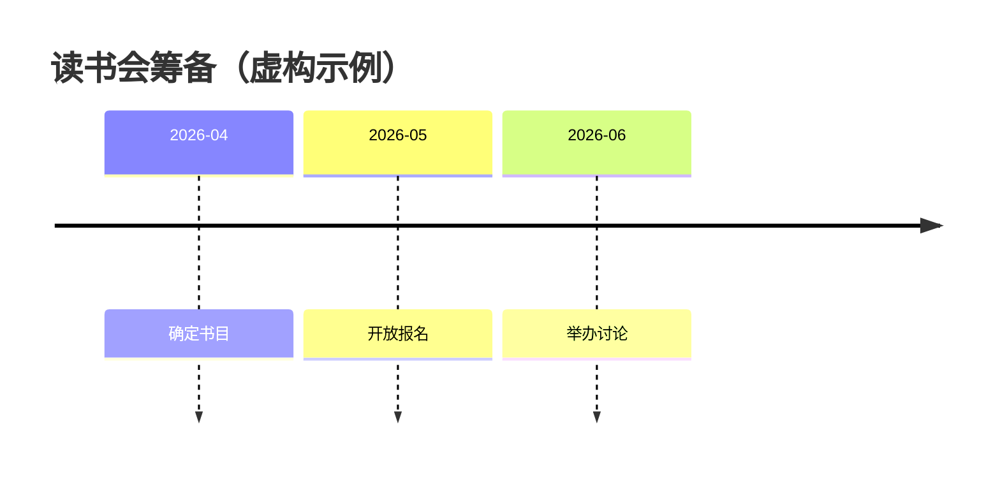

# Timeline

Use for dated milestones or named periods. Labels must identify events and their supplied dates; timeline layout does not establish measured duration or proportional spacing.

Fictional example: a reading club schedules three preparation milestones. Timeline fits because the question is “what happens in each month?” The month and event labels are indispensable. The dates below are invented for teaching and must not be substituted into a real project plan.

Summary: the fictional club selects a book in April, opens registration in May, and meets in June.

Verify timeline support in the target host. Keep unknown dates unknown; do not estimate dates merely to fill a timeline. For durations, dependency scheduling, or quantitative trends, return the need to the appropriate owner instead of claiming this view proves those properties.

Official syntax: https://mermaid.js.org/syntax/timeline.html
